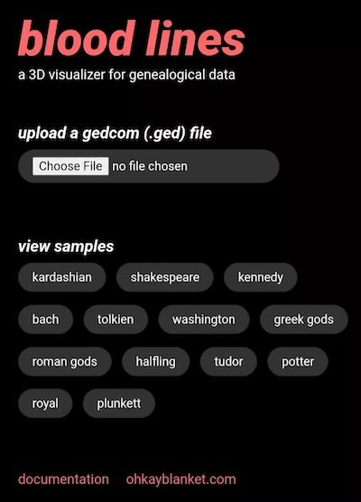
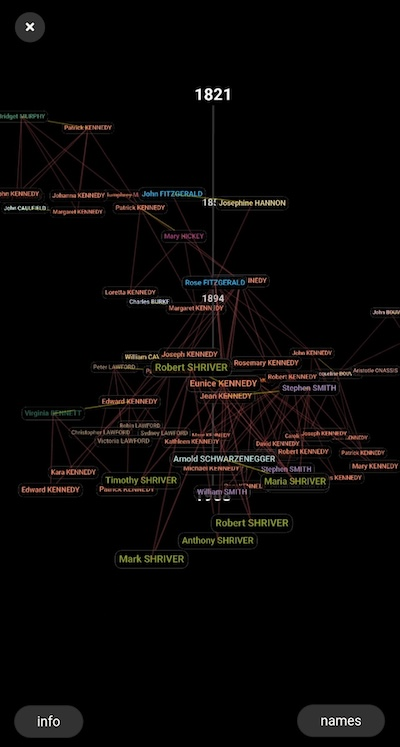
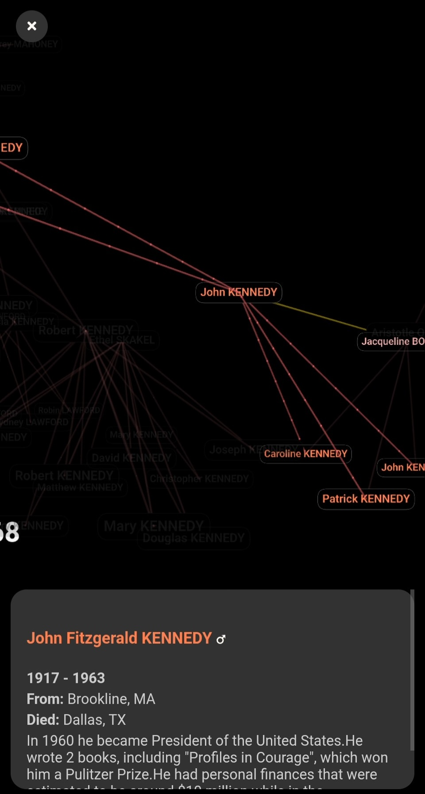
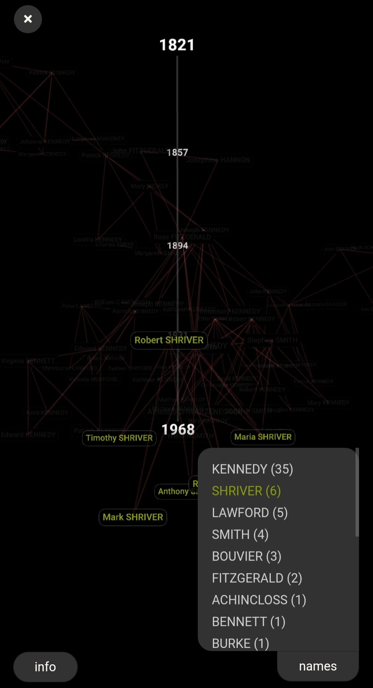

# Family Plot

**Family Plot** is an interactive 3D family tree visualizer and editor. Upload GEDCOM files, build trees from scratch, add photos, and explore genealogies in a force-directed 3D graph.

[](https://family-plot.ohkaycomputer.com/)

---

## Demo

[Try Family Plot Live](https://family-plot.ohkaycomputer.com)

---

## Features

- **3D Visualization** — Force-directed graph with timeline positioning by birth year
- **GEDCOM Import/Export** — Upload `.ged` or `.gedz` files, export in either format
- **Create from Scratch** — Start a new family tree and add people directly
- **Edit Mode** — Edit names, dates, places, bios, gender, and relationships
- **Photo Support** — Attach photos to people; photos are bundled into `.gedz` exports
- **Search** — Find people by name with camera zoom to selection
- **Surname Filtering** — Highlight and filter by family name
- **Relationship Highlighting** — Click a person to trace ancestors, descendants, and spouses
- **Sample Trees** — Pre-loaded trees including Kennedy, Shakespeare, Tudor, Tolkien, Greek gods, and more
- **Light/Dark Theme** — Toggle with persistent preference
- **Name Format** — Switch between "First Last" and "Last, First"
- **PWA** — Installable as a standalone app with offline support
- **Mobile Support** — Touch gestures via Hammer.js (tap, pinch, swipe)

---

## Screenshots

<p float="left">
  
  
  
  
</p>

---

## Usage

### Getting Started

- **Upload a file** — Import a `.ged` or `.gedz` file from your genealogy software
- **Start new** — Create a blank family tree and add people manually
- **Explore samples** — Load a pre-included tree (e.g., Kennedy, Shakespeare)

### Controls

**Desktop:**
- Left-click drag: rotate
- Right-click drag: pan
- Scroll: zoom
- Click node: highlight family tree

**Mobile:**
- Tap: select person
- Pinch: zoom
- Swipe: rotate
- Two-finger swipe: pan

### Editing

Click the edit icon on any person's info panel to open the edit panel. From there you can edit details, manage relationships (parents, spouses, children), upload a photo, or delete the person.

### Exporting

Open settings (gear icon) and choose `.ged` or `.gedz` export. The `.gedz` format is a ZIP containing the GEDCOM file plus any attached photos.

### Importing GEDCOM Files

Most genealogy platforms support GEDCOM export:

- **Ancestry** — Trees > Settings > Export tree
- **MyHeritage** — Family Tree > Manage tree > Export to GEDCOM
- **FamilySearch** — Use third-party tools like RootsMagic to export
- **GRAMPS** — Family Trees > Export > GEDCOM

For more about GEDCOM, see the [Wikipedia article](https://en.wikipedia.org/wiki/GEDCOM).

---

## Running Locally

### Prerequisites

- [Node.js](https://nodejs.org/) (v14+)

### Installation

```bash
git clone https://github.com/oh-kay-blanket/family-plot.git
cd family-plot
npm install
npm start
```

### Building & Deploying

```bash
npm run build       # Production build to dist/
npm run deploy      # Build + deploy to GitHub Pages
```

### Build Number

A build number in `build-number.json` is automatically incremented on each `npm run deploy`. It's injected at build time via webpack `DefinePlugin` as `__BUILD_NUMBER__`.

---

## Project Structure

```
src/
├── index.js            # Root app component, state management
├── Graph.js            # 3D force-directed graph, timeline, highlighting
├── Controls.js         # Search, settings, surname filter, node info
├── Load.js             # Landing page, file upload, sample selector
├── EditPanel.js        # Edit panel for people and relationships
├── SampleButton.js     # Sample tree button component
├── gedcomExport.js     # GEDCOM/GEDZ export and import
├── gedcom/
│   ├── parse.js        # GEDCOM parser
│   └── d3ize.js        # Transform to graph data structure
├── gedcoms/            # Sample GEDCOM files
├── service-worker.js   # PWA offline caching
├── manifest.json       # PWA manifest
├── sass/               # Styles (Sass)
└── img/                # Icons, screenshots
```

---

## Technologies

- [React](https://reactjs.org/)
- [Three.js](https://threejs.org/) + [three-spritetext](https://github.com/vasturiano/three-spritetext)
- [react-force-graph-3d](https://github.com/vasturiano/react-force-graph-3d)
- [d3-force-3d](https://github.com/vasturiano/d3-force-3d)
- [Hammer.js](https://hammerjs.github.io/) (touch gestures)
- [JSZip](https://stuk.github.io/jszip/) (.gedz packaging)
- [Webpack](https://webpack.js.org/) + [Sass](https://sass-lang.com/)

---

## Acknowledgments

- [tmcw/parse-gedcom](https://github.com/tmcw/parse-gedcom) — GEDCOM parser
- [vasturiano/3d-force-graph](https://github.com/vasturiano/3d-force-graph) — 3D force-directed graph

---

## License

ISC License. See [LICENSE](LICENSE) for details.

---

## Contact

[ohkaycomputer.com](https://ohkaycomputer.com/) · [GitHub Issues](https://github.com/oh-kay-blanket/family-plot/issues)
